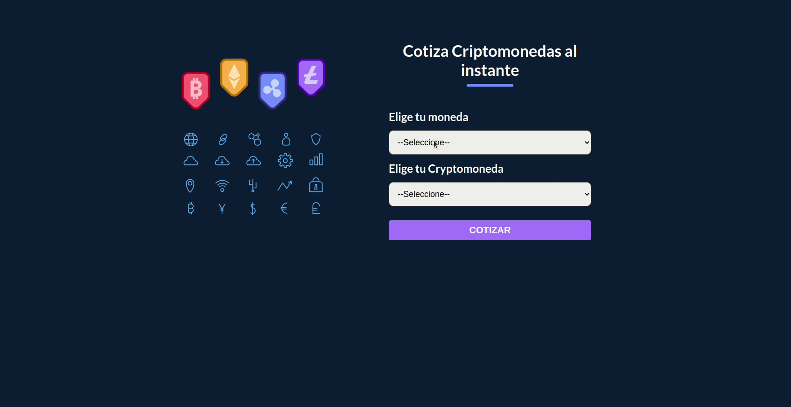

# App de Cotizador de Cryptomonedas

App elaborada con la librería React, utilizando hooks propios de la mismas y algunas librería externas para mejorar la experiencia de usuario. Se utilizó Style Components par dar estilos de manera personalizada a cada componente, evitando que una modificación de los mismo altere los demas.
La APP mediante una llama a una API externa permite cotizar el precio de cualquier cryptomoneda en el valor de cualquier moneda, o las principales. EL proyecto cuenta con la creación de hook propio para ser reutilizable en otro componente. Las opciones de las diferentes cryptomonedas se obtienen de manera dinámica de la misma info recibida por la API (https://www.cryptocompare.com/). Se incluyo un spinner para mejorar la experiencia del usuario mientras demora las respuesta de la API.

[Acceso a App](https://cotizador-cryptomonedas.vercel.app/)

## Video Demo

## Ejecutando este Proyecto

1. Abre la terminal de Git
2. Cambia el directorio de trabajo actual a la ubicación en donde quieres clonar el directorio.
   `cd proyecto`

3. Escribe git clone seguido de la [URL](https://github.com/emanuelheredia/cotizador-cryptomonedas) del proyecto

`git clone https://github.com/emanuelheredia/cotizador-cryptomonedas `

4. Presiona Enter para crear tu clon local

    > $ git clone https://github.com/YOUR-USERNAME/YOUR-REPOSITORY
    > Cloning into `Spoon-Knife`...
    > remote: Counting objects: 10, done.
    > remote: Compressing objects: 100% (8/8), done.
    > remove: Total 10 (delta 1), reused 10 (delta 1)
    > Unpacking objects: 100% (10/10), done.

5. Instalar todas las dependencias necesarias dentro del directorio del proyecto
   `npm install`

6. Por último inicia el proyecto con npm start donde se iniciará el dashboard de expo en el navegador
   `npm start`

# Mis Redes :

-   [GITHUB](https://github.com/emanuelheredia)
-   [LINKEDIN](https://www.linkedin.com/in/emanuel-heredia-41749421a/)
